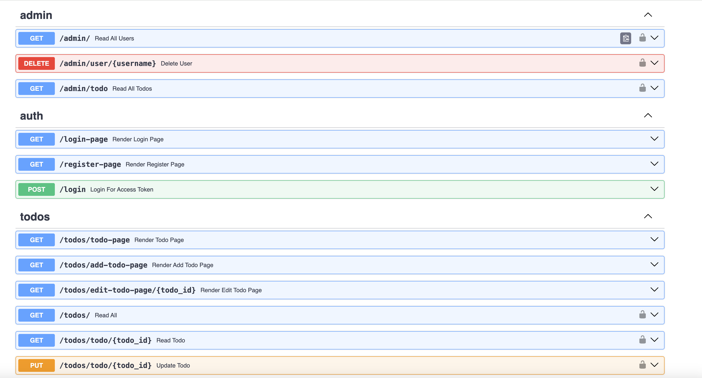

## Run

- be on root directory
- `poetry run uvicorn backend.app:app --reload`
- `poetry run pytest backend/test --disable-warnings`
- `poetry run gunicorn -w 4 -k uvicorn.workers.UvicornWorker backend.app:app --bind 0.0.0.0:8000`


## docker (Dockerfile)
- `to build a python docker file 
`docker build -f backend/Dockerfile -t my-fastapi-app .`

- run docker
`docker run -p 8000:8000 my-fastapi-app`

- access the page at
`http://127.0.0.1:8000/docs`


## docker-compose
`docker compose -f backend/docker-compose-local.yaml up --build`


## poetry initial setup

```
poetry init -n # to create initial .toml file
poetry add fastapi bcrypt==4.0.1 python-multipart passlib uvicorn pydantic sqlalchemy python-jose psycopg2-binary jinja2
poetry add --group dev pytest pytest-asyncio httpx # for development only
```


### Endpoints FrontEnd and Backend

```
admin.py
(BE) GET         /admin/user              -  Read all Users
(BE) DELETE      /admin/{username}        - delete a user by username
(BE) GET         /admin/todo              - delete all todo

auth.py
(BE) GET        /login                   - Get a token of an existing user
(FE) GET        /register-page            - Render register page
(FE) GET        /login-page               - Render login page

todos.py
(BE) GET          /todos/                         - Read all Todos of a user
(BE) GET          /todos/{todo_id}                - Read Todo by ID of a user
(BE) POST         /todos/todos                   - Create a new todos of a user
(BE) PUT          /todos/todo/{todo_id}          - Update an existing todo of a user
(BE) DELETE       /todos/todo/{todo_id}        - Delete an existing todo of a user
(FE) GET          /todo-page                      - Render Todo page
(FE) GET          /add-todo-page                  - Render Add Todo page
(FE) GET          /edit-todo-page/{todo_id}       - Render Edit Todo page

users.py
(BE) GET          /user/                         -  get user
(BE) POST         /user/register                  - register a user
(BE) PUT          /user/password                   - change password
(BE) PUT          /user/phonenumber/{phone_number} - change phone number

health.py
(BE) GET         /health                  - check system status
```


EXAMPLE
    


#### notes

### Backend Engineering
- ~~CRUD operations~~
- ~~Query String, Path Parameters~~

#### Data Validation
- ~~Input Request Validation using `typing` and `pydantic`~~
- ~~Input Request example using `model_config`~~
- ~~Path Parameter Validation using `Path`~~
- ~~Query Parameter Validation using `Query`~~

### Database 

- ~~`alembic` (data migration tool)~~
- ~~`MySQL` , `PostgreSQL` , `sqlite`~~


### Testing, CI/CD

- ~~Unit Testing~~
- Integration Testing
- end-to-end testing
- CI/CD using gitlab, gitHub Actions 
- GitHub Actions
- MLOps
- DevSecOps
- Makefile, lint, rough

### Debugging
- ~~python tools to debug code~~


### Front-end 
- Full-stack application development using `React`
- ~~Full-stack application development using `jinja`, `HTML/CSS/BootStrap/JS`~~

### Optimization, performance improvements

- Asyncronouse programming/Concurrency
- Caching using Redis
- Database indexing
- ~~`pydantic model` vs `SQLAlchdmy` model~~

### Security 
 - ~~`OAuth2` , `jwt`~~
 - ~~Authentication & Authorization~~
 -  session-based vs ~~token-based~~
 - `OAuth2`
 - `SSL`, `TLS`

### Scalability, Fault-tolerance, reliability
 - Load balancing, 
 - ~~Reverse proxy `Nginx`~~
 - Autoscaling infrastructure.
 - Rate limit
 - ~~`Exception/Error Handling, `HTTPException`, `status`~~
 - ~~health-check~~
 - ~~middleware `cors` , `logging`~~


### Interaction patterns

- HTTP/HTTPS
- GraphQL
- WebSocket
- gRPC


### Deployment

- ~~Docker/Docker compose~~
- Kubernates
- Deployment to AWS Infrastructure, as lambda, ECS/Farget, ~~EC2~~
- production grade deployment (`docker-compose`)
- IaC, Terraform, CDK, Serverless
- CDN 
- domain name/route 53, HTTP, HTTPS certificate


### AI/ML

- Machine learning + Python
- GenAI

### Monitoring and obeservation

- ~~DataDog~~
- X-ray

### Real-time data handling
- Stream processing
- video, audio
- handling real-time streaming application
- Stream Analytics


-  ~~pydantic?~~
- starlett?
-  ~~poetry?~~
- UV

### other architecture
- Concurrency and idempotency.
- Job scheduling and cron systems.
- Events, message queues, and workers.
- Clean Architecture
- architecture pattern: `data_pool (database)`
